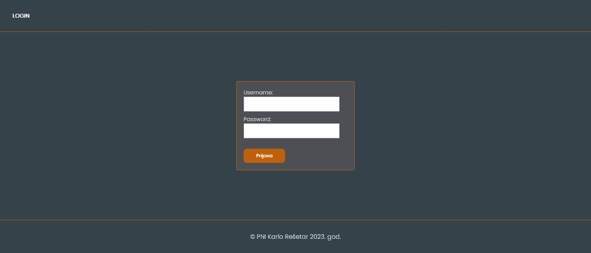
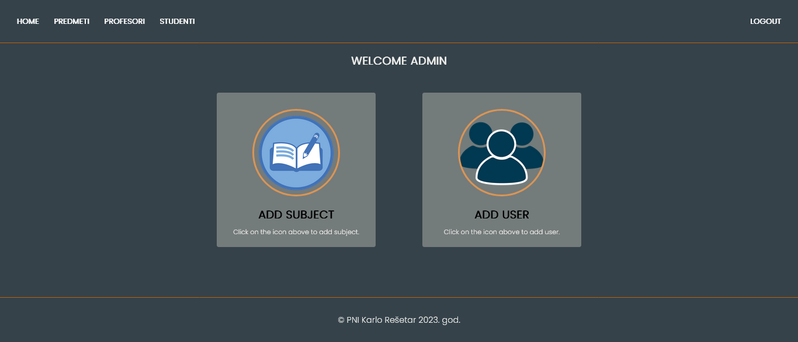
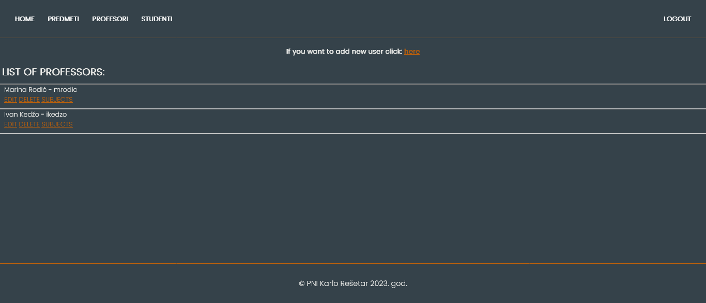
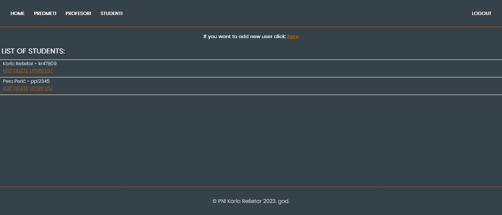

# Programiranje Na Internetu - Seminar

## Description

This project is a student enrollment system. The system consists of three roles: student, professor, and administrator.

## Project Preview

### Login Page

### Admin Portal

### Professor portal

### Student portal

## Features

### Administrator Role

- Authentication
- Viewing and modifying the list of subjects
- Adding a new subject
- Assigning a subject to a professor
- Viewing the list of students
- Adding and editing students
- Creating/modifying an enrollment form for any student
- Viewing the list of professors
- Adding and editing professors
- Viewing the list of students for each individual subject (add a link "view student list" to each subject)
- The Django admin system is not allowed for the administrator role.

### Professor Role

- Authentication
- Viewing the list of subjects for the logged-in professor
- Viewing the list of students for each subject (where the logged-in professor is the instructor)
- Changing the status of a subject (by default, it is "enrolled" and can be changed to "passed" or "failed". A subject can be dropped until the status is changed to "passed/failed").
- Viewing students for each subject based on the following criteria:
  1. Students who have failed the subject
  2. Students who have received a pass but have not yet passed the subject
  3. Students who have passed the subject

### Student Role

- Authentication
- Enrolling/dropping subjects

## Installation

### Technologies & languages

- [HTML,CSS,Python(Django),SQLite]
### Instructions

1. Activate the virtual environment by running the following command:
- source venv/Scripts/activate
2. Navigate to the project directory:
- cd myProject/
3. Start the server:
- python manage.py runserver

## Author ##
| Name | Surname | GitLink |
| ------ | ------ | ------ |
| Karlo | Rešetar | [GitHub profile KR](https://github.com/karloresetar). |
